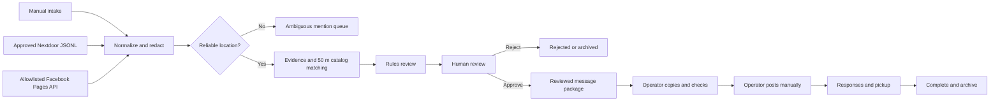
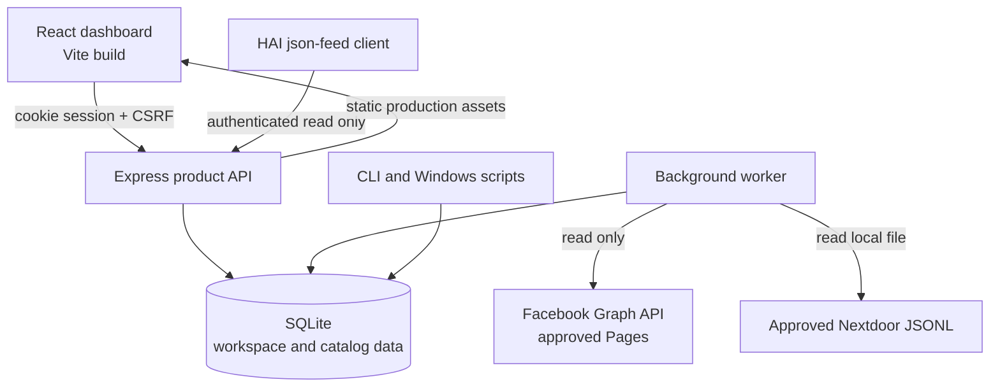

# Weggeefkastje.nl Automation

A local-first, human-reviewed workspace for discovering, checking and coordinating Dutch `weggeefkastje` and neighbourhood-sharing activity.

> **Important:** this application does not scrape private Facebook groups or Nextdoor spaces, bypass logins, publish posts, or contact people automatically. Facebook intake is limited to explicitly configured Pages through the official Graph API. Nextdoor intake requires an administrator-approved JSONL export. A person reviews every usable mention and performs every external publication step.

## Contents

- [What this project is](#what-this-project-is)
- [Who it is for](#who-it-is-for)
- [What the application does](#what-the-application-does)
- [What it deliberately does not do](#what-it-deliberately-does-not-do)
- [How the workflow works](#how-the-workflow-works)
- [Data sources, matching and review](#data-sources-matching-and-review)
- [Application screens](#application-screens)
- [Architecture](#architecture)
- [Quick start](#quick-start)
- [Windows 11 installation](#windows-11-installation)
- [Docker](#docker)
- [Configuration reference](#configuration-reference)
- [Provider setup](#provider-setup)
- [HAI integration](#hai-integration)
- [Command reference](#command-reference)
- [HTTP API overview](#http-api-overview)
- [Data model and migrations](#data-model-and-migrations)
- [Security, privacy and compliance](#security-privacy-and-compliance)
- [Operations, backup and recovery](#operations-backup-and-recovery)
- [Testing, CI and verification](#testing-ci-and-verification)
- [Troubleshooting](#troubleshooting)
- [Known limitations and readiness](#known-limitations-and-readiness)
- [Repository structure](#repository-structure)
- [Further documentation](#further-documentation)

## What this project is

A **weggeefkastje** is a small public cupboard where neighbours can leave and take useful items, food or books for free. Mentions of new, moved or removed cupboards are scattered across websites, public social pages and neighbourhood communities. They can be incomplete, duplicated, outdated or contain personal information.

This repository provides an operator workspace that turns those loose signals into a controlled process:

1. collect a manual tip or an approved external mention;
2. remove obvious contact details and validate the location evidence;
3. compare it with the existing SQLite catalog;
4. quarantine ambiguous information and present the rest for human review;
5. prepare a privacy-conscious message package;
6. let the operator copy, inspect and post that message manually;
7. track responses, pickup or follow-up, completion and archival;
8. retain evidence and an audit history of important decisions.

The product UI is in Dutch. This README is in English so both local operators and software contributors have one technical reference.

### At a glance

| Area | Current implementation |
| --- | --- |
| Product form | Authenticated web dashboard plus a separate background worker |
| Main stack | Node.js, TypeScript, Express, React, Vite and SQLite |
| Storage | Local SQLite database under `APP_DATA_DIR` |
| Accounts | First-run owner account; workspace roles are `owner`, `operator` and `viewer` |
| Manual intake | Supported in the dashboard |
| Facebook | Read-only official Page Graph API for an explicit Page allowlist |
| Nextdoor | Read-only ingestion of an administrator-approved JSONL export |
| Matching | Evidence identity plus same-city coordinate matching within 50 metres |
| Uncertain mentions | Kept in a separate review queue; not silently published |
| External posting | Manual only; there is no provider write API in the application |
| HAI | Optional authenticated, incremental, privacy-redacted, read-only JSON feed |
| Primary platform | Windows 11, with regular Node.js and Docker workflows also included |
| Network default | Loopback only (`127.0.0.1`) |
| Repository status | The implemented local critical path and clean CI are verified; live provider/account acceptance requires operator-owned access |

## Who it is for

### Community operators and volunteers

Use the dashboard to record tips, review source-labelled records, reject unsafe or incomplete records, prepare messages and track the human follow-up. You do not need to know TypeScript or SQLite for routine use.

### Project owners and administrators

Use the owner role to initialize a workspace, activate the safety stop, configure server-side providers, make backups, run diagnostics and control public exposure.

### Software developers and maintainers

Use this repository to develop the API, worker, React dashboard, ingestion adapters, matching rules, migrations and operational tooling. The codebase is intentionally local-first and fail-closed around provider access.

## What the application does

### Intake and evidence

- Creates manual records with a title, description, category, target platform, source, city, optional location hint or coordinates, confidence and privacy level.
- Reads configured Facebook Page posts through the official Graph API.
- Parses a line-delimited JSON export approved for Nextdoor use.
- Recognizes Dutch sharing terms including `weggeefkastje`, `buurtkastje`, `deelkastje`, `ruilkastje`, `voedselkastje` and `minibieb` variants.
- Redacts common email addresses and Dutch-style phone numbers from ingested social text.
- Preserves source name, link, observation time, a short summary and evidence hashes for traceability.

### Matching and review

- Ignores provider records that are not relevant sharing-cupboard mentions.
- Treats an address hint or coordinates as reliable enough to enter the actionable intake path.
- Sends mentions without a reliable location to an ambiguity queue.
- Avoids importing the same evidence twice.
- Deduplicates catalog locations in the same city when coordinates are at most 50 metres apart.
- Retains new evidence when a record matches an existing location.
- Keeps new items review-gated; social intake does not create an automatically published public record.
- Prevents an unverified removal report from silently removing an active location.

### Human-controlled workflow

- Evaluates deterministic safety and completeness rules.
- Records explicit review decisions and workflow transitions.
- Produces a message package only after the item reaches the appropriate state.
- Requires the operator to copy and inspect the generated package before “posted” can be recorded.
- Records that the operator confirmed a manual post; copying alone never counts as publication.
- Tracks responses, pickup arrangements, completion, rejection, cancellation and archival.
- Supports idempotency keys and optimistic item versions to reduce duplicate actions and conflicting edits.

### Operations

- Runs recurring social intake, session cleanup, stale-item review and retention jobs in a separate worker.
- Retries failed jobs up to their configured attempt limit.
- Offers cheap liveness and database-backed readiness endpoints.
- Includes migrations, diagnostics, reconciliation, backup, restore, checksums, privacy export and redacted support-bundle commands.
- Includes Windows background-process scripts, a guarded ngrok launcher, Docker packaging and GitHub Actions CI.

## What it deliberately does not do

The following are outside the product’s authority and are not hidden future behavior:

- no scraping of private Facebook groups, private Nextdoor areas or other login-protected communities;
- no bypassing authentication, CAPTCHAs, paywalls or technical access controls;
- no browser automation that impersonates a social-media user;
- no automatic Facebook or Nextdoor publishing;
- no mass messaging, automated replies or automated pickup agreements;
- no collection of full profiles, unrelated comments or private conversations;
- no HAI write-back, approval power or inherited Gmail/Google Drive/provider authority;
- no automatic geocoding, email delivery, push notifications, billing, file uploads or AI-generated decisions;
- no claim that live Facebook, Nextdoor, ngrok or HAI accounts have been accepted without the repository owner supplying and validating them.

These constraints are part of the design. They protect residents, operators and the project from false positives, privacy leaks and prohibited platform access.

## How the workflow works



### Workflow states

| Internal status | Meaning in the UI | Typical next step |
| --- | --- | --- |
| `draft` | Concept | Submit for rule review |
| `rules_review` | Rules checking | Pass rules or reject |
| `human_review` | Waiting for review | Approve or reject |
| `ready_to_post` | Ready for manual posting | Copy, inspect and post manually |
| `posted` | Manually posted | Record a response |
| `responding` | Following responses | Schedule pickup/follow-up |
| `pickup_scheduled` | Appointment confirmed | Mark complete after confirmation |
| `completed` | Picked up/completed | Archive |
| `rejected` | Rejected | Archive |
| `cancelled` | Cancelled | Archive |
| `archived` | Closed historical record | No further workflow action |

Every state change is validated server-side. Invalid transitions are rejected even if a client calls the API directly.

## Data sources, matching and review

### Product application path

The normal product path uses [`src/server-main.ts`](src/server-main.ts), [`src/api/app.ts`](src/api/app.ts), [`src/worker.ts`](src/worker.ts) and the `exchange_items` workflow tables. Use `npm run dev`, `npm start` and `npm run worker` for this path.

| Source | How it enters | Safety behavior |
| --- | --- | --- |
| Manual tip | Dashboard form | Validated, then placed in the review workflow |
| Facebook | Official Graph API `/PAGE_ID/posts` for configured Pages | Page allowlist, pinned API version, bounded pagination, HTTPS/hostname validation, read only |
| Nextdoor | Approved JSONL file inside `APP_DATA_DIR` | No browser/login scraper; parsed locally and read only |
| HAI | HAI reads this application’s feed | Outbound read-only metadata view; HAI is not an intake or mutation authority |

The worker schedules provider intake once per workspace per UTC day when at least one provider is configured. A workspace owner can activate the safety stop to block provider intake while leaving manual data available.

### Catalog compatibility path

The repository also retains the earlier catalog import/export utility in [`src/index.ts`](src/index.ts), [`src/db/sqlite.ts`](src/db/sqlite.ts) and [`src/server.ts`](src/server.ts). Run it with:

```powershell
npm run ingest
```

This utility can combine:

- manual JSONL tips from `MANUAL_TIPS_PATH`;
- a Buurtkastjeskaart JSON or HTML export from `BUURTKASTJESKAART_EXPORT_PATH`;
- the approved Nextdoor JSONL export;
- configured Facebook Page posts.

It updates the catalog, writes a public app export to `EXPORT_PATH`, and writes ambiguous social mentions to `SOCIAL_REVIEW_PATH`.

`src/server.ts` exposes a small legacy loopback API when this importer is invoked with `--serve`. It predates product authentication and should **not** be exposed publicly. New integrations should use the authenticated `/api` application in `src/server-main.ts`.

### Approved Nextdoor JSONL shape

Each non-empty line must be one JSON object. A compact example:

```json
{"sourceName":"Approved neighbourhood export","observedAt":"2026-08-01T10:00:00.000Z","text":"Nieuw weggeefkastje bij de Dorpsstraat","city":"Utrecht","addressHint":"Dorpsstraat","link":"https://example.invalid/source"}
```

Recognized fields include `text`/`message`/`content`/`description`, source name, observation time, link, city, address hint, latitude, longitude, municipality, province, status and notes. See [`data/approved-nextdoor-export.example.jsonl`](data/approved-nextdoor-export.example.jsonl) for the maintained example.

## Application screens

| Screen | Purpose |
| --- | --- |
| **Overzicht** | Shows work that needs attention and key counts |
| **Intake** | Shows drafts and items at the rules stage; the global button creates a manual intake |
| **Beoordelen** | Shows rule/human review items and ambiguous social mentions |
| **Publiceren** | Shows items ready for manual posting and items confirmed as posted |
| **Coördinatie** | Tracks responses, appointments and completed handovers |
| **Archief** | Shows archived, rejected and cancelled records |
| **Instellingen** | Shows workspace settings and, for owners, the provider safety stop |

The interface is responsive, paginates item lists, searches by title/place/category and keeps a persistent warning that publication is manual.

## Architecture



### Runtime components

| Component | Entry point | Responsibility |
| --- | --- | --- |
| Product server | `src/server-main.ts` | Loads configuration, opens the application database, serves `/api`, health routes and production web assets |
| Express application | `src/api/app.ts` | Authentication, CSRF, role checks, workflow endpoints, diagnostics and HAI feed |
| Dashboard | `web/src/App.tsx` | Dutch operator UI for setup, queues, review, posting and coordination |
| Worker | `src/worker.ts` | Schedules recurring jobs and drains the durable SQLite job queue |
| Job runner | `src/jobs/runner.ts` | Social intake, stale review, retention and expired-session cleanup |
| Application database | `src/db/appDatabase.ts` | Workspace-scoped records, workflow, sessions, jobs, audit and backup |
| Catalog database | `src/db/sqlite.ts` | Location/evidence storage, catalog matching and legacy review actions |
| Social adapter | `src/adapters/socialEvidence.ts` | Facebook/Nextdoor parsing, mention filtering, redaction and location gating |
| CLI | `src/cli.ts` | Migrations, diagnostics, backup/restore, export and support operations |
| Legacy importer | `src/index.ts` | Compatibility catalog ingestion and public JSON export |

The product server and worker are separate processes but share one SQLite file. SQLite foreign keys, WAL mode and a busy timeout are configured by the database layer. All application queries that hold product data are scoped to a workspace.

## Quick start

### Requirements

- Node.js `>=20 <26` (CI currently uses Node.js 24)
- npm, using the committed `package-lock.json`
- a C/C++ build environment only when npm cannot download a prebuilt `better-sqlite3` binary
- PowerShell for the supplied Windows lifecycle scripts
- Docker Desktop only if using the container workflow

### Development mode

```powershell
Copy-Item .env.example .env
npm ci
npm run migrate
npm run dev
```

Open <http://127.0.0.1:5173>. Vite serves the dashboard and proxies API requests to `127.0.0.1:3000`.

On first use, create the owner account and workspace. The password must contain at least 12 characters. Complete this setup locally before considering any reverse proxy or tunnel.

The worker is not part of `npm run dev`; start it in a second terminal when testing recurring jobs or provider intake:

```powershell
npm run worker
```

For a finite run that schedules and drains currently due work once:

```powershell
npm run worker -- --once
```

### Production build on the local machine

```powershell
npm ci
npm run build
npm run migrate
npm start
```

Open <http://127.0.0.1:3000>. Start the worker separately with `npm run worker`.

`npm start` serves compiled files from `dist/` and `dist-web/`; rerun `npm run build` after source changes.

## Windows 11 installation

The one-time installer restores locked dependencies, builds the frontend and backend, applies migrations and runs database diagnostics:

```powershell
powershell -NoProfile -ExecutionPolicy Bypass -File scripts\install-windows.ps1
```

It creates `.env` from `.env.example` only when `.env` does not already exist.

Start the production server and worker as validated hidden background processes:

```powershell
npm run windows:start
```

Stop only the processes previously recorded for this application:

```powershell
npm run windows:stop
```

Runtime PID files are stored under `data/runtime`; logs are stored under `data/logs`. The stop script verifies the command line before stopping a recorded PID.

For a stable public HTTPS endpoint through ngrok, first complete local setup and configure ngrok v3, then run:

```powershell
powershell -NoProfile -ExecutionPolicy Bypass -File scripts\start-ngrok.ps1 -PublicUrl https://your-domain.ngrok.app
```

The launcher requires an exact stable HTTPS URL, a healthy initialized database, trusted-proxy settings and secure cookies. It keeps Express on loopback, disables remote first-run setup and disables ngrok request inspection. See [`docs/WINDOWS_AND_NGROK.md`](docs/WINDOWS_AND_NGROK.md) before exposing the service.

## Docker

Build and run the loopback-only local deployment:

```powershell
docker compose up --build
```

The Compose stack runs an `app` service and a separate `worker` service against the same named data volume. Open <http://127.0.0.1:3000>.

Stop the stack with:

```powershell
docker compose down
```

The image uses a disposable Node 24 build stage with Python, `make` and `g++` for native dependencies. The runtime image is slim, runs as a non-root user and includes a `/health` health check.

The supplied Compose file is intentionally a local development topology: it publishes only to `127.0.0.1` and does not terminate TLS. For a public container deployment, add a trusted HTTPS reverse proxy and explicitly configure `NODE_ENV=production`, `APP_BASE_URL`, `TRUST_PROXY=true`, `COOKIE_SECURE=true` and the deliberate network-binding flags.

## Configuration reference

Copy [`.env.example`](.env.example) to `.env`. Never commit `.env` or real credentials.

### Product server and security

| Variable | Default/example | Meaning |
| --- | --- | --- |
| `NODE_ENV` | `development` | `development`, `test` or `production` |
| `HOST` | `127.0.0.1` | Bind address; non-loopback binding is refused unless explicitly enabled |
| `PORT` | `3000` | HTTP port, from 1 through 65535 |
| `APP_DATA_DIR` | `data` | Root for the database, approved exports, backups and generated support files |
| `DATABASE_PATH` | `data/weggeefkastjes.sqlite` | SQLite path; it must resolve inside `APP_DATA_DIR` |
| `WEB_DIST_PATH` | `dist-web` | Compiled frontend directory |
| `SESSION_TTL_HOURS` | `24` | Session lifetime; accepted range is 1–720 hours |
| `RATE_LIMIT_PER_MINUTE` | `120` | General per-process request limit; accepted range is 10–1000 |
| `TRUST_PROXY` | `false` | Trust one reverse-proxy hop; enable only for a known proxy |
| `ALLOW_NETWORK_BINDING` | `false` | Required before binding to a non-loopback host |
| `ALLOW_REMOTE_SETUP` | `false` | Whether first-owner setup can occur remotely; keep false for normal operation |
| `APP_BASE_URL` | unset | Exact external base URL; a non-loopback production bind requires HTTPS |
| `COOKIE_SECURE` | inferred | Forces secure-cookie behavior; required for public production binding |
| `ENABLE_DEMO_MODE` | `false` | Optional development flag; forbidden in production |
| `WORKER_POLL_MS` | `5000` | Worker polling interval; accepted range is 250–60,000 ms |

### Social providers

| Variable | Default | Meaning |
| --- | --- | --- |
| `NEXTDOOR_APPROVED_EXPORT_PATH` | unset | Approved JSONL path; it must resolve inside `APP_DATA_DIR` |
| `FACEBOOK_GRAPH_ACCESS_TOKEN` | unset | Server-side Graph API token; configure with the version |
| `FACEBOOK_GRAPH_API_VERSION` | unset | Explicit version such as `vXX.X`; required with the token |
| `FACEBOOK_PAGE_CONTEXTS_JSON` | `[]` | JSON allowlist of Page IDs and optional location defaults |

Example Page allowlist:

```dotenv
FACEBOOK_PAGE_CONTEXTS_JSON=[{"id":"1234567890","name":"Approved local page","city":"Utrecht","municipality":"Utrecht","province":"Utrecht"}]
```

### HAI feed

| Variable | Default | Meaning |
| --- | --- | --- |
| `HAI_FEED_TOKEN` | unset | Random secret of at least 32 characters; enables the feed |
| `HAI_WORKSPACE_ID` | unset | Required when the database does not contain exactly one workspace |
| `HAI_PROJECT_KEY` | `015-Weggeefkastje` | Project key attached to feed records |

### Compatibility importer

These variables are consumed by `npm run ingest`, not by the normal React product flow:

| Variable | Default | Meaning |
| --- | --- | --- |
| `MANUAL_TIPS_PATH` | `data/manual-tips.example.jsonl` | Manual catalog tips |
| `BUURTKASTJESKAART_EXPORT_PATH` | unset | Optional `.json`, `.html` or `.htm` catalog export |
| `FACEBOOK_MAX_POSTS_PER_PAGE` | `100` | Per-Page Facebook limit for the compatibility importer only |
| `SOCIAL_REVIEW_PATH` | `data/review/social-mentions.json` | Ambiguous-mention output |
| `EXPORT_PATH` | `data/exports/app-locations.json` | Public catalog output |

## Provider setup

### Facebook Pages

1. Obtain authorized Page access for the intended use through Meta’s official process.
2. Set an access token and explicit API version together.
3. Add only approved Page IDs to `FACEBOOK_PAGE_CONTEXTS_JSON`.
4. Restart the worker.
5. Verify a controlled read in operator diagnostics and review the resulting records.

For each Page, the adapter requests a bounded set of posts and fields: post ID, message, creation time, permalink and place. Pagination is capped and every next-page URL must remain HTTPS on `graph.facebook.com`.

The repository does not include a Meta token, does not obtain permissions on the operator’s behalf and does not claim live Facebook acceptance.

### Nextdoor

1. Obtain an export through a platform- or administrator-approved process.
2. Remove private-member fields that are not needed for the cupboard record.
3. Store the JSONL inside `APP_DATA_DIR`.
4. Set `NEXTDOOR_APPROVED_EXPORT_PATH` to that file.
5. Restart the worker and review the imported or quarantined mentions.

There is intentionally no Nextdoor browser scraper or login automation.

### Disabling provider work immediately

An owner can enable **Veiligheidsstop** under **Instellingen**. The worker checks this before social intake. Manual records remain readable and editable so an operator can investigate without losing local access.

## HAI integration

The optional HAI connector exposes an authenticated JSON feed at:

- `GET /api/integrations/hai/health`
- `GET /api/integrations/hai/feed?cursor=...`

It is incremental, stable by external ID, limited to 100 records per page and read only. Drafts are excluded. Exact address hints, coordinates, pickup notes, contacts and private descriptions are not exported.

Preferred clients send:

```http
Authorization: Bearer <HAI_FEED_TOKEN>
```

HAI’s current generic JSON-feed connector uses an `access_token` query parameter instead of a custom header. Keep that compatibility URL local-only and rotate the token if the HAI source configuration is exposed. Full setup instructions and the connected-source payload are in [`docs/HAI_INTEGRATION.md`](docs/HAI_INTEGRATION.md).

## Command reference

### Development and verification

| Command | Purpose |
| --- | --- |
| `npm run dev` | Run API and Vite dashboard in watch mode |
| `npm run dev:api` | Run only the product API in watch mode |
| `npm run dev:web` | Run only the Vite dashboard |
| `npm run serve` | Run the TypeScript product server without a frontend build step |
| `npm run build` | Compile server files and production web assets |
| `npm run build:server` | Compile server TypeScript to `dist/` |
| `npm run build:web` | Compile the React app to `dist-web/` |
| `npm start` | Run the compiled product server |
| `npm run worker` | Run the long-lived TypeScript worker |
| `npm run worker -- --once` | Schedule and drain due jobs, then exit |
| `npm test` | Run the Vitest suite |
| `npm run test:coverage` | Run tests with V8 coverage |
| `npm run smoke` | Run the critical-path test only |
| `npm run lint` | Run ESLint |
| `npm run typecheck` | Type-check server and web projects |
| `npm run benchmark` | Run the bounded local API benchmark |

### Database and operator CLI

| Command | Purpose |
| --- | --- |
| `npm run migrate` | Create/open the database and apply all versioned migrations |
| `npm run doctor` | Print redacted configuration plus integrity/migration diagnostics; fails when unhealthy |
| `npm run cli -- reconcile` | Run a read-only integrity and foreign-key reconciliation report |
| `npm run backup` | Create an online SQLite backup under `data/backups` |
| `npm run cli -- checksum --file data/backups/file.sqlite` | Calculate a SHA-256 checksum for a file inside `APP_DATA_DIR` |
| `npm run cli -- restore --from data/backups/file.sqlite --confirm` | Preserve the current database, restore the selected copy and validate it |
| `npm run cli -- export` | Export the first workspace’s privacy/audit data under `data/exports` |
| `npm run cli -- export --workspace UUID --out data/exports/name.json` | Export a selected workspace to a selected in-data path |
| `npm run cli -- support-bundle` | Write redacted configuration and diagnostics under `data/support` |
| `npm run cli -- ready-for-tunnel` | Verify database setup, HTTPS base URL, proxy trust, secure cookies and disabled remote setup |
| `npm run cli -- worker` | Schedule recurring work and drain the current queue once |
| `npm run cli -- help` | List CLI commands |

### Packaging and compatibility

| Command | Purpose |
| --- | --- |
| `npm run windows:install` | One-time Windows dependency/build/migration/doctor sequence |
| `npm run windows:start` | Start compiled server and worker in the background |
| `npm run windows:stop` | Stop the validated application processes |
| `npm run ingest` | Run the legacy-compatible catalog importer/exporter |
| `docker compose up --build` | Build and start the local container stack |

## HTTP API overview

The React dashboard is the supported client. This overview is for maintainers and integrations; consult [`src/api/app.ts`](src/api/app.ts) for schemas and response details.

### Public bootstrap and health routes

| Route | Purpose |
| --- | --- |
| `GET /health` | Cheap liveness check; does not prove setup is complete |
| `GET /ready` | Database integrity/migration/setup readiness; returns 503 until ready |
| `GET /api/setup/status` | Whether the first owner still needs to be created |
| `POST /api/setup` | Create the first owner/workspace; loopback-only unless explicitly enabled |
| `POST /api/auth/login` | Create an authenticated session |
| `GET /api/auth/status` | Check the current browser session |
| `GET /api/integrations/hai/health` | Token-authenticated HAI connector check |
| `GET /api/integrations/hai/feed` | Token-authenticated read-only HAI feed |

### Authenticated application routes

| Route group | Purpose |
| --- | --- |
| `/api/auth/me`, `/api/auth/logout` | Current identity and session termination |
| `/api/dashboard` | Workspace counts and attention summary |
| `/api/items` | Paginated/filterable item listing and authorized creation |
| `/api/items/:id` | Detail, optimistic update and owner-only deletion |
| `/api/items/:id/actions` | Validated workflow transitions |
| `/api/items/:id/message-package/copy` | Audit the operator’s copy step |
| `/api/review` and `/api/review/summary` | Item review and ambiguous social queue |
| `/api/review/mentions/:id/dismiss` | Mark an ambiguous mention unusable |
| `/api/notifications` | List and acknowledge local notifications |
| `/api/privacy/export` | Return a workspace-scoped privacy/audit export |
| `/api/settings` | Return workspace settings and safety status |
| `/api/operator/safety-stop` | Owner-only provider intake stop |
| `/api/operator/diagnostics` | Redacted operational and provider status |

Authenticated mutations require the session’s `x-csrf-token`. Sessions use the `wk_session` HttpOnly cookie. API responses disable caching and return structured error codes plus a request ID.

## Data model and migrations

Migrations are append-only and run automatically when `AppDatabase` opens. `npm run migrate` makes the action explicit for installation and deployment.

Current migration groups:

1. workspace authentication, exchange workflow, evidence, rules, message packages, coordination, history, audit, review decisions, notifications, jobs, feature flags and analytics;
2. provider checkpoints and workspace settings;
3. ambiguous social-review mentions;
4. cursor, item-list and session indexes.

Key relationships:

- a user belongs to a workspace through `workspace_members` and has an `owner`, `operator` or `viewer` role;
- an `exchange_item` owns evidence, rule evaluations, a reviewed message package, workflow events and coordination events;
- audit events record consequential actions independently of the item’s current state;
- jobs are durable, idempotent and retried rather than being held only in process memory;
- the catalog location/evidence tables support public-location matching and legacy export compatibility.

Do not edit a production SQLite file manually. Use migrations, application APIs and the backup/restore tooling.

## Security, privacy and compliance

### Implemented controls

- Passwords are hashed with scrypt.
- Browser sessions use random opaque tokens; only SHA-256 token hashes are stored.
- Session cookies are HttpOnly and SameSite=Strict, with Secure required for public production binding.
- State-changing application requests require a per-session CSRF token.
- Product data access is scoped to the authenticated workspace.
- Owner/operator/viewer roles protect actions; deletion and the safety stop are owner-only.
- General and authentication-specific rate limits are enabled.
- JSON request bodies are limited to 256 KiB.
- Helmet supplies Content Security Policy, clickjacking, object, referrer and related browser protections.
- Public network binding fails closed unless deliberately enabled; public production binding additionally requires HTTPS configuration.
- Database, provider-export, backup, restore and support paths must remain inside `APP_DATA_DIR`.
- Provider credentials remain server-side and are redacted from public configuration, diagnostics and support bundles.
- Facebook next-page URLs must remain HTTPS on `graph.facebook.com`.
- Contact details are redacted from social evidence and public message content.
- Important authentication, review, copy, workflow, privacy and safety-stop actions are audited.

### Operator responsibilities

- Collect only information needed to verify and coordinate a cupboard or giveaway.
- Prefer approximate locations when an exact private-home address is unnecessary.
- Do not copy complete private posts, profiles, comments or conversations into the application.
- Verify the source and location before approval.
- Keep low-confidence and ambiguous reports unpublished.
- Respect correction and removal requests promptly without destroying investigation evidence prematurely.
- Protect the host, database, backups, exports and `.env`; access to the SQLite file is access to its data.
- Review the exact generated message before posting it manually.

Read [`docs/SECURITY.md`](docs/SECURITY.md) and [`docs/COMPLIANCE_AND_PRIVACY.md`](docs/COMPLIANCE_AND_PRIVACY.md) before enabling a provider or public endpoint.

## Operations, backup and recovery

### Normal routine

1. Keep the product server and worker running as separate processes.
2. Check `/ready`, the dashboard review count and operator diagnostics.
3. Verify source, giveaway language, location quality and privacy before approval.
4. Copy and inspect a message package, post it yourself, then record the confirmed result.
5. Record only the minimum response/pickup information needed.
6. Run `npm run doctor` after upgrades or configuration changes.
7. Take regular backups and periodically test a restore.

### Backup

```powershell
npm run backup
npm run cli -- checksum --file data/backups/<file>.sqlite
```

The backup uses SQLite’s online backup mechanism. Store independent copies according to the project’s retention and access policy.

### Restore

Stop both server and worker, then run:

```powershell
npm run cli -- restore --from data/backups/<file>.sqlite --confirm
```

The command first makes a recovery copy of the current database, copies the selected backup into place and reopens it for integrity and migration checks. Keep the recovery-copy path printed by the command until the restored service has been accepted.

### Incident response

1. Enable the workspace safety stop.
2. Stop the worker.
3. Revoke affected provider credentials at the provider.
4. Take a backup and generate a redacted support bundle.
5. Inspect audit and workflow history without deleting evidence during triage.
6. Rotate credentials, repair configuration, run `npm run doctor` and resume with one controlled intake.

The full routine, failure playbooks and release checklist are in [`docs/OPERATOR_RUNBOOK.md`](docs/OPERATOR_RUNBOOK.md).

## Testing, CI and verification

### Local verification commands

```powershell
npm ci
npm audit --audit-level=high
npm run lint
npm run typecheck
npm test
npm run build
npm run smoke
npm run doctor
```

If Docker is available:

```powershell
docker build -t weggeefkastje-automation:test .
docker compose config --quiet
```

### What the automated suite covers

- the full manual critical path from intake through archive;
- authentication, CSRF, roles and cross-workspace isolation;
- configuration path and network-binding failures;
- bounded paging and literal wildcard search;
- approved social parsing, redaction and ambiguity quarantine;
- Facebook Page allowlisting and pagination-host checks;
- 50-metre coordinate matching and evidence retention;
- worker idempotency, retries, stale review and retention behavior;
- online backup completion and database integrity;
- HAI authentication, cursor behavior, privacy redaction and read-only output;
- remote first-run setup protection.

GitHub Actions runs a clean Node 24 install, dependency audit, lint, server/web type-check, all tests, production build and Docker image build for pull requests and pushes to `main`.

The latest recorded verification for the current implementation reports 22 tests across 8 files, zero high/critical npm audit findings, successful production builds and a successful clean Linux Docker build. Browser acceptance covered desktop and 390 px layouts with no console errors or warnings. The recorded 500-item local benchmark achieved 41 requests/second with p50 311 ms and p95 962 ms at concurrency 20 on the shared test host. Treat these as reproducible baseline evidence, not a universal performance guarantee. See [`docs/FINAL_VERIFICATION_REPORT.md`](docs/FINAL_VERIFICATION_REPORT.md) for exact scope and external blockers.

## Troubleshooting

### `npm ci` fails while installing `better-sqlite3`

Use a supported Node.js version (`>=20 <26`). If no prebuilt binary exists for the current runtime, install a native compiler toolchain. On Windows that normally means the current Visual Studio Build Tools with C++ support and Python. The Docker build stage already includes Python, `make` and `g++`.

### `/ready` returns HTTP 503

Read the response body. Common causes are pending first-owner setup, a failed integrity check or an unexpected migration state. Run:

```powershell
npm run migrate
npm run doctor
```

`/health` returning 200 only proves that the process is alive; use `/ready` for service readiness.

### First setup is rejected through ngrok or a proxy

This is expected with `ALLOW_REMOTE_SETUP=false`. Stop public exposure, open the service locally, create the first owner/workspace, then run `npm run cli -- ready-for-tunnel` before reopening the tunnel.

### Facebook is shown as `not_configured`

Set both `FACEBOOK_GRAPH_ACCESS_TOKEN` and `FACEBOOK_GRAPH_API_VERSION`, plus at least one valid Page context. Blank values are treated as absent. Restart the worker after changes.

### Facebook is `configured_unverified`

Configuration was accepted, but the application intentionally does not claim the external token, Page permissions or live API call are valid until a controlled read succeeds. Check the worker log and provider account.

### Nextdoor records do not appear

Confirm that the path exists inside `APP_DATA_DIR`, the file is valid line-delimited JSON, the text contains a recognized sharing-cupboard term, and each useful record has an address hint or coordinates. Location-less records appear under **Beoordelen** instead of the normal item list.

### A provider job keeps failing

The worker records the failure and retries up to the job limit. Do not infer external success from an ambiguous timeout. Activate the safety stop if needed, inspect server/worker logs and operator diagnostics, then verify credentials, Page scope, API version or export format.

### `mark_posted` is disabled or rejected

The reviewed message package must be copied first. Copying is an auditable preparation step, not proof of publication. After you manually post the reviewed content, explicitly mark it as posted.

### Restore is refused

The source must resolve inside `APP_DATA_DIR`, exist, and be supplied with `--confirm`. Stop concurrent server/worker access and use a file under `data/backups` unless `APP_DATA_DIR` has been changed deliberately.

### Windows stop refuses a PID

The script will not stop a process whose command line does not match this application. Inspect `data/runtime` and the running process; remove a stale PID file only after confirming that the recorded process is no longer the application.

## Known limitations and readiness

### Verified in code, tests or local packaging

- authenticated local application and full review/post-confirmation/coordination workflow;
- approved-source parsing, contact redaction, evidence preservation and matching;
- separate worker, durable retries, retention and stale-review jobs;
- security guards, database diagnostics, backup and validated restore;
- Windows production server/worker lifecycle;
- responsive production web application;
- authenticated privacy-redacted HAI feed contract;
- clean Linux CI and Docker image build.

### Requires operator-owned external acceptance

- a real approved Facebook app/token and Page permission;
- a real administrator-approved Nextdoor export;
- an operator-owned stable ngrok endpoint or production reverse proxy;
- a running owner-authenticated HAI instance and connected-source registration;
- the actual manual social post and any real-world response/pickup outcome.

### Deferred or not implemented

- member invitation/administration UI beyond first-owner setup;
- English UI localization;
- a dedicated frontend component-test suite and formal assistive-technology audit;
- geocoding, email/push delivery, uploads, billing and autonomous AI features;
- automatic social posting or messaging, by design.

Do not use “CI passed” as a substitute for live provider acceptance. Conversely, missing external credentials do not prevent local operation or testing of the controlled workflow.

## Repository structure

```text
.
├── .github/workflows/ci.yml       Clean install, audit, static checks, tests, build, Docker
├── data/                          Safe example inputs; runtime data is ignored
├── docs/                          Audits, runbooks, acceptance evidence and integration guides
├── scripts/                       Windows install/start/stop and guarded ngrok launcher
├── src/
│   ├── adapters/                  Manual, public-export and approved social intake
│   ├── api/                       Authenticated Express product API
│   ├── auth/                      Password hashing
│   ├── core/                      Normalization and geographic distance
│   ├── db/                        Catalog DB, app DB and migrations
│   ├── domain/                    Workflow, rules and message-package logic
│   ├── export/                    Catalog and social-review exports
│   ├── integrations/              HAI read-only feed
│   ├── jobs/                      Recurring and retryable work
│   ├── benchmark.ts               Bounded local benchmark
│   ├── cli.ts                     Operator/database CLI
│   ├── index.ts                   Compatibility importer/exporter
│   ├── server-main.ts             Product server entry point
│   ├── server.ts                  Legacy loopback catalog API
│   └── worker.ts                  Background worker entry point
├── tests/                         Unit, API, boundary, worker and critical-path tests
├── web/                           React/Vite operator dashboard
├── .env.example                   Safe configuration template
├── Dockerfile                     Multi-stage non-root production image
├── docker-compose.yml             Loopback-only local app/worker stack
└── package.json                   Runtime, scripts and Node version contract
```

Generated databases, exports, backups, runtime files, logs, support bundles, provider credentials and `.env` must remain outside version control.

## Further documentation

| Document | Audience and purpose |
| --- | --- |
| [`docs/OPERATOR_RUNBOOK.md`](docs/OPERATOR_RUNBOOK.md) | Daily operation, provider setup, incident and release playbooks |
| [`docs/WINDOWS_AND_NGROK.md`](docs/WINDOWS_AND_NGROK.md) | Windows background operation, stable ngrok exposure and container notes |
| [`docs/HAI_INTEGRATION.md`](docs/HAI_INTEGRATION.md) | Exact HAI token and connected-source setup |
| [`docs/SECURITY.md`](docs/SECURITY.md) | Threat model, implemented controls, residual risk and incident response |
| [`docs/COMPLIANCE_AND_PRIVACY.md`](docs/COMPLIANCE_AND_PRIVACY.md) | Permitted collection channels and data-minimization guidance |
| [`docs/CRITICAL_PATH.md`](docs/CRITICAL_PATH.md) | Canonical end-to-end operator workflow |
| [`docs/ACCEPTANCE_TESTS.md`](docs/ACCEPTANCE_TESTS.md) | Acceptance scenarios and automated/manual evidence |
| [`docs/FINAL_VERIFICATION_REPORT.md`](docs/FINAL_VERIFICATION_REPORT.md) | Verified implementation scope, benchmark and external blockers |
| [`docs/TECHNICAL_AUDIT.md`](docs/TECHNICAL_AUDIT.md) | Architecture and production-risk audit |
| [`docs/API_USAGE_AUDIT.md`](docs/API_USAGE_AUDIT.md) | External API inventory and authority boundaries |
| [`docs/UI_ACTION_AUDIT.md`](docs/UI_ACTION_AUDIT.md) | UI action-to-backend wiring audit |
| [`docs/GOAL_COMPLETION_MATRIX.md`](docs/GOAL_COMPLETION_MATRIX.md) | Requirement-by-requirement implementation status |
| [`docs/TASK_GRAPH.md`](docs/TASK_GRAPH.md) | Implementation dependency graph |
| [`docs/IMPLEMENTATION_PLAN.md`](docs/IMPLEMENTATION_PLAN.md) | Original phased build plan |
| [`docs/CODEX_WORKLOG.md`](docs/CODEX_WORKLOG.md) | Implementation work log |
| [`docs/CODEX_CHECKPOINTS.md`](docs/CODEX_CHECKPOINTS.md) | Recorded delivery checkpoints |

## Contributing and change safety

Before changing provider behavior, privacy rules, matching thresholds, authentication, workflow transitions or public network exposure:

1. read the relevant security, privacy and operator documents;
2. preserve human review and manual posting;
3. add or update tests for the changed boundary;
4. run lint, type-check, tests and production build;
5. update this README and the relevant detailed document when behavior changes;
6. keep provider credentials, real exports and personal data out of commits and test fixtures.

This package is marked `private` and the repository currently does not include a license file. Do not assume permission to redistribute or reuse the code outside the repository owner’s terms.
