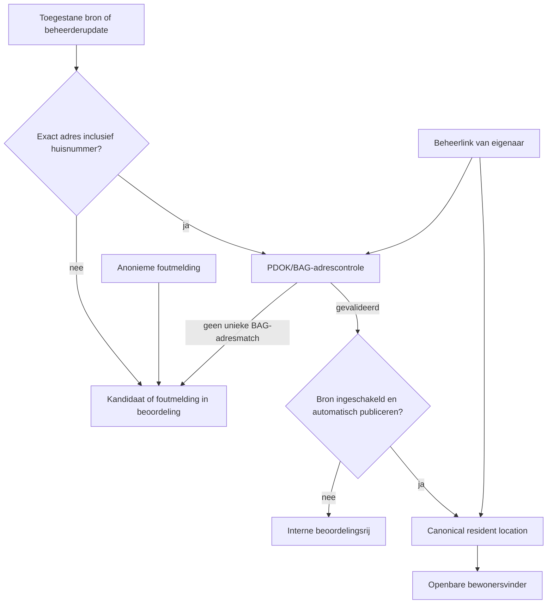

# Weggeefkastje bewonersvinder - product- en technische specificatie

## Status en besluitbasis

Deze specificatie legt de door Robert gekozen productrichting vast op 4 september 2026. Zij vervangt voor de bewonersfunctie de oudere aanname dat een mens elke locatie altijd moet goedkeuren. De bestaande beheeromgeving blijft bestaan als backoffice; de bestaande handmatige externe publicatieworkflow blijft onveranderd van kracht.

Het eerder aangeleverde PDF-bestand met de grote doelprompt stond tijdens deze implementatie niet meer op het opgegeven lokale pad. Deze specificatie is daarom gebaseerd op de aanwezige repository, het bronbeleid dat daarin al bestaat en de expliciete productbesluiten uit het gesprek.

## Productdoel

Maak een gratis, neutrale en zeer eenvoudige landelijke bewonersdienst waarmee iemand zonder account een bestaand buurt- of weggeefkastje kan vinden. De eerste inzet kan in een gemeente plaatsvinden, maar data, bronbeleid en zoekfunctie mogen geen technische beperking tot een gemeente bevatten.

Een gepubliceerde locatie is alleen bruikbaar wanneer zij een exact, gevalideerd Nederlands adres heeft. De dienst toont dat exacte adres, de actuele status, een laatste verificatiemoment en een routeknop. Zij verzamelt geen locatie van de bezoeker, account, contactgegevens of sociale-profielgegevens om een kastje te vinden.

## Mensen en rollen

| Rol | Doel | Account nodig | Bevoegdheid |
| --- | --- | --- | --- |
| Buurtbewoner | Een kastje vinden en een fout bij een bestaand kastje melden. | Nee | Alleen openbare, gevalideerde locatiegegevens lezen; foutmelding indienen. |
| Eigenaar of beheerder van een kastje | Het eigen kastje actueel houden. | Nee, maar wel een persoonlijke beheerlink. | Status en locatie van uitsluitend het eigen kastje aanpassen. |
| Projectbeheerder | Bronnen instellen, records controleren en beheerlinks uitgeven. | Ja | Interne catalogus, bronregister en auditspoor beheren. |
| Bronhouder | Een officiële bron, erkende export of openbare kaart leveren. | Niet per se | Alleen gegevens aanleveren via een vastgelegde, toegestane route. |

Gemeenten zijn geen primaire gebruikersgroep en de dienst is geen gemeentelijk beheersysteem. Donateurs zijn evenmin een afzonderlijke doelgroep.

## Harde productregels

1. De bewonersfunctie werkt zonder account en zonder apparaatlocatie.
2. Iedere openbare vermelding heeft een straat, huisnummer, postcode en plaats die door de BAG/PDOK-adresdienst als een adres is bevestigd. Coördinaten of een straat zonder huisnummer zijn niet genoeg.
3. Een bron mag alleen automatisch worden verwerkt wanneer de toegangsvorm, toestemming of licentie in het bronregister is vastgelegd. Het openen van een ingelogde browser is nooit toestemming.
4. Automatisch publiceren is per bron instelbaar. Voor automatisch publiceren zijn zowel een ingeschakelde bron als een exact gevalideerd adres vereist. Een bron in beoordelingsmodus maakt wel een kandidaat, maar geen openbare vermelding.
5. Iedere automatische toevoeging, wijziging, samenvoeging, bronbeslissing, beheerderwijziging en publieke foutmelding krijgt een onveranderlijk domeingebonden wijzigingsevenement en een bestaand algemeen auditrecord.
6. Een ontbrekend record in een bron of een anonieme melding verwijdert een kastje nooit automatisch. Alleen een geautoriseerde eigenaar of een interne beheerder kan het uit de openbare resultaten halen; de reden blijft auditbaar.
7. Volledige sociale-berichttekst, namen, telefoonnummers, e-mailadressen, profielinformatie en groepscontext worden niet aan bewoners getoond. Bestaande redactielogica blijft vóór opslag van sociale tekst actief.
8. Privé Facebook-groepen en privé Nextdoor-gebieden mogen alleen worden verwerkt via een schriftelijk vastgelegde toestemming en een daarvoor ondersteunde officiële API of beheerders-export. De software voert geen browser- of login-scraping uit.
9. De huidige Facebook Graph Page-intake blijft beperkt tot een expliciete Page-allowlist. Nextdoor blijft beperkt tot een door een beheerder goedgekeurde JSONL-export totdat een partnerintegratie schriftelijk is geautoriseerd.
10. Een bron op OpenStreetMap wordt alleen binnen een expliciet geconfigureerd pilotgebied bevraagd. De bronvermelding en ODbL-verplichting worden in het bronregister vastgelegd; het systeem doet geen landelijke Overpass-query zonder grens.

## Publicatie- en adresbeslissing

Een locatie doorloopt deze beslisboom:

Een exacte match betekent dat de kandidaat en het PDOK-resultaat na normalisatie dezelfde straat, hetzelfde huisnummer met eventuele toevoeging, dezelfde postcode en dezelfde plaats hebben. De externe adresdienst is een verificatie van een reeds aangeleverd adres en geen vrijbrief om adressen uit coördinaten of sociale tekst af te leiden.

## Canonieke catalogus

`AppDatabase` wordt de enige bron van waarheid voor de bewonersvinder. De historische tabellen `locations` en `evidence` blijven alleen bestaan voor de compatibiliteitsimporter en worden niet meer door de publieke API geraadpleegd of door de nieuwe worker geschreven.

De catalogus gebruikt deze domeinobjecten:

| Object | Verantwoordelijkheid | Belangrijke inhoud |
| --- | --- | --- |
| `source_registry` | Per bron toegang, transparantie en publicatiebeleid vastleggen. | sleutel, naam, toegangsvorm, licentie/toestemmingsreferentie, attributie, actief, automatische of beoordelingsmodus, exact-adres-toestemming, laatste controle. |
| `resident_locations` | Eén actueel, exact adresbaar kastje per werkruimte. | titel, volledig BAG-adres, postcode, plaats, coördinaten, status, publicatiestatus, categorieën, laatste verificatie. |
| `resident_location_evidence` | Herleidbaar maken waar een locatie of wijziging op steunt. | bron, hash, veilige samenvatting, URL waar toegestaan, waarnemingstijd. |
| `resident_location_events` | Volledig, leesbaar wijzigingsspoor voor de catalogus. | actie, actorsoort, vóór/na-samenvatting, bron of aanvraag, tijdstip. |
| `location_update_requests` | Niet-geverifieerde publieke foutmeldingen en te beoordelen kandidaten opslaan. | type, veilige beschrijving, voorgestelde gegevens, status, reden. |
| `caretaker_tokens` | Een accountloze eigenaar veilig beperkte wijzigingsrechten geven. | alleen hash van een willekeurig token, vervaldatum, intrekking, laatste gebruik. |

De unieke herkenning van een kastje is een genormaliseerde combinatie van straat, huisnummer/toevoeging, postcode en plaats binnen een werkruimte. Een tweede bewijsstuk bij dezelfde locatie verrijkt bewijs en verificatietijd in plaats van een tweede publiek resultaat te maken. Een twijfelgeval wordt nooit automatisch samengevoegd.

## Bronnen

| Bron | Toegang en status | Standaardmodus | Gebruik in deze release |
| --- | --- | --- | --- |
| Facebook Pages | Official Graph API, alleen geconfigureerde allowlist. | Beoordelen | Huidige adapter blijft; een exact adres is alsnog verplicht. |
| Nextdoor | Schriftelijk toegestane JSONL-export van een beheerder. | Beoordelen | Huidige lokale export blijft; een partner-API is niet geactiveerd of aangevraagd. |
| OpenStreetMap | Open data met bronvermelding/ODbL en begrensde Overpass-query. | Beoordelen | Nieuwe adapter, alleen na expliciete pilot-bounding-box en broninschakeling. |
| Buurtkastjeskaart-export | Door operator aangewezen toegestane JSON/HTML-export. | Beoordelen | Bestaande parser wordt vanuit de nieuwe worker benut wanneer geconfigureerd. |
| Eigenaarbeheerlink | Persoonlijke, beperkt geldige link die een beheerder bewust uitgeeft. | Automatisch | Exact adres wordt altijd opnieuw gevalideerd; eigenaar kan de eigen vermelding deactiveren. |
| Handmatige of publieke melding | Geen automatische externe bron. | Beoordelen | Alleen correctie van een bestaand kastje; geen openbare nieuwe-locatie-suggestiepad. |

Een beheerder kan een bron pas naar automatisch publiceren schakelen wanneer hij of zij de toegangsvorm, licentie/toestemming en het recht om het exacte adres publiek te tonen heeft opgeslagen. Een sociale bron kan technisch automatisch worden gezet, maar de software houdt het standaard in beoordelingsmodus omdat betrouwbaarheid zwaarder weegt dan bereik.

## Bewonerservaring

De root van de webapp wordt de bewonersvinder. De bestaande login en operatoromgeving verhuist functioneel naar `/beheer` zonder bestaande mogelijkheden te verwijderen.

De bewonersvinder bevat:

- één duidelijke zoekinvoer voor plaats, postcode, straat of naam;
- een toegankelijke resultatenlijst met de naam, het volledige adres, laatste verificatie en routeknop;
- een rustige lege-status wanneer er geen gevalideerde kastjes zijn;
- een foutmelding voor uitsluitend bestaande locaties, zonder naam-, e-mail- of telefoonveld;
- een duidelijke ingang voor een eigenaar met een persoonlijke beheerlink;
- geen kaarttegel, tracking-script, browserlocatie of sociale broninhoud.

`/beheer` krijgt catalogus- en bronregisterschermen naast de bestaande workflow. Daar kan een operator records beoordelen, publieke foutmeldingen afhandelen, een beheerlink genereren of intrekken, en bronbeleid wijzigen. De bestaande intake voor externe plaatsingspakketten blijft een afzonderlijke operatorfunctie; hij wordt niet als bewonersfeature herbestemd.

## API-contracten

Alle endpoints onder `/api/public` worden vóór de bestaande authenticatiemiddleware geregistreerd en hebben hun eigen rate limiter. Hun antwoorden bevatten nooit een bron-URL, brontekst, eigenaargegevens, verzoekinhoud, token of auditdetails.

| Endpoint | Doel | Autorisatie |
| --- | --- | --- |
| `GET /api/public/locations?query=&limit=` | Alleen gepubliceerde, actieve, exact gevalideerde locaties zoeken. | Geen account |
| `GET /api/public/locations/:id` | Eén gepubliceerde locatie lezen. | Geen account |
| `POST /api/public/locations/:id/reports` | Fout over een bestaande locatie melden; maakt uitsluitend een beoordelingsverzoek. | Geen account, rate limited |
| `GET /api/public/caretaker/:token` | Beheerlink valideren en beperkte huidige gegevens van één kastje tonen. | Geldig bearer-token |
| `POST /api/public/caretaker/:token` | Exact adres/status van één kastje wijzigen; adres wordt opnieuw gevalideerd. | Geldig bearer-token, rate limited |
| `GET/POST/PATCH /api/resident-locations...` | Catalogus beheren, beoordelen en beheerlink uitgeven. | Ingelogde owner/operator, CSRF voor writes |
| `GET/POST/PATCH /api/sources...` | Bronregister lezen en beheren. | Ingelogde owner/operator, CSRF voor writes |

De openbare werkruimte wordt alleen gekozen wanneer precies één werkruimte openbare locator-data heeft, of wanneer de beheerder expliciet `PUBLIC_WORKSPACE_ID` configureert. Bij meerdere mogelijke werkruimtes faalt de publieke endpoint dicht in plaats van gegevens over werkruimtes te mengen.

## Automatisering

De worker voert ingeschakelde, geconfigureerde bronnen dagelijks uit en gebruikt per bron en bewijsstuk idempotente hashes. Hij doet de volgende veilige verwerking:

1. Lees alleen de toegestane export of officiële API.
2. Redigeer sociale inhoud en verwerp vermeldingen zonder precies adres.
3. Valideer een volledig aangeleverd adres met de PDOK Locatieserver/BAG.
4. Zoek een canonieke adressleutel en voeg bewijs toe of maak een kandidaat/locatie.
5. Publiceer alleen wanneer de bronpolicy automatisch is en alle harde controles slagen.
6. Noteer een catalogus- en algemeen auditrecord.
7. Verwijder nooit op basis van het uitblijven van bronresultaten.

PDOK wordt benaderd via de actuele officiële Locatieserver `free`-endpoint met `fq=type:adres`; de implementatie gebruikt een injecteerbare fetch-functie en een timeout zodat tests geen live netwerk nodig hebben. De publieke dienst is een adresverificatiebron, niet een ontdekkingsbron.

## Privacy, veiligheid en toegankelijkheid

- Exacte adressen zijn alleen openbaar wanneer het bronregister dit recht heeft of de eigenaar die via een beheerlink bevestigt. Een mogelijk privé-adres zonder die grond blijft intern te beoordelen.
- Beheerlinks zijn lange willekeurige bearer-secrets. Alleen een SHA-256-hash staat in SQLite; links kunnen vervallen, worden ingetrokken en opnieuw worden uitgegeven.
- Bewonersfoutmeldingen nemen alleen een beperkte, privacywaarschuwende tekst aan. Zij kunnen geen locatie aanmaken en veroorzaken geen directe verwijdering.
- Publieke endpoints geven een beperkte paginagrootte, exacte foutcodes en geen onderscheidende aanwijzing over niet-gepubliceerde records.
- Formulieren hebben labels, beschrijvingen, toetsenbordbediening, zichtbare foutmeldingen en niet alleen kleur als statussignaal.
- Externe routeknoppen openen pas na gebruikersactie. De app deelt geen vertrekpunt of browserlocatie met een kaartdienst.

## Buiten de releasegrens

- geen live Nextdoor-partneraanvraag of niet-geautoriseerde Nextdoor API;
- geen scraping van inlog-, privé- of gesloten communities;
- geen automatische Facebook- of Nextdoor-publicatie;
- geen landelijke Overpass-opdracht zonder expliciete pilotbegrenzing;
- geen e-mailbezorging of accountregistratie voor bewoners/eigenaren;
- geen migratie die oude, onvolledige `locations` zonder exacte BAG-verificatie automatisch publiceert;
- geen publiek delen van origineel sociaal bewijs, persoonsgegevens of eigenaarcontact.

## Acceptatiecriteria

1. Een bezoeker zonder sessie ziet uitsluitend actieve, exact geverifieerde locaties van de juiste openbare werkruimte en kan ze zoeken.
2. Een kandidaat met alleen stad, straat of coördinaten wordt nooit gepubliceerd.
3. Een automatisch ingestelde bron met een unieke PDOK/BAG-adresmatch kan een locatie publiceren zonder handmatige review.
4. Dezelfde bron in beoordelingsmodus maakt een interne aanvraag en geen publiek record.
5. Iedere create/update/merge/publicatie/deactivatie bevat zowel catalogusgeschiedenis als auditmetadata.
6. Een anonieme foutmelding laat een bestaande locatie zichtbaar totdat een gemachtigde actie volgt.
7. Een geldige beheerlink kan alleen het gekoppelde kastje wijzigen; een ingetrokken, verlopen of onjuiste link geeft geen gegevens vrij.
8. Facebook, Nextdoor en OpenStreetMap gebruiken alleen hun geconfigureerde, toegestane invoerroute; tests bewijzen dat geen browser/private scrapingpad bestaat.
9. De huidige operatorworkflow, authenticatie, CSRF-bescherming, HAI-feed en legacy compatibility commands blijven compileren en hun bestaande tests behouden.
